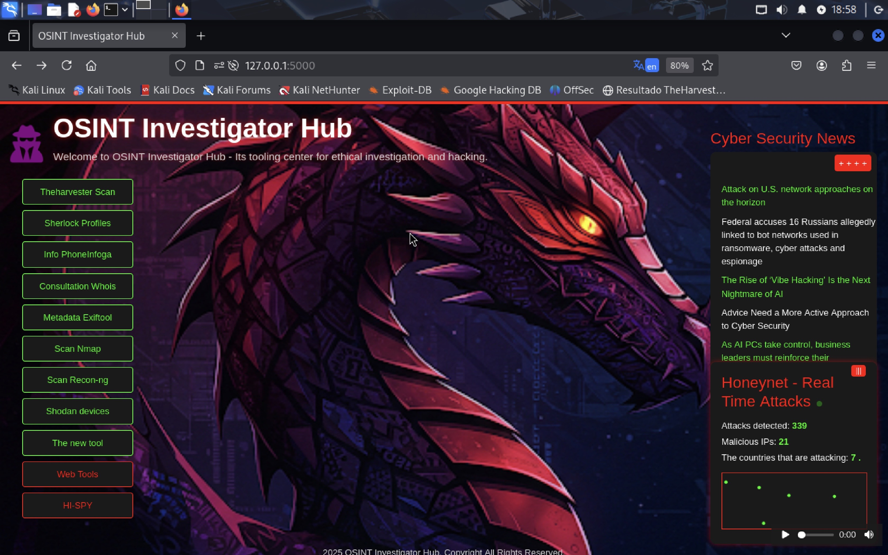

# OSINT Investigator Hub
This project is a web-based OSINT (Open-Source Intelligence) tool built with Flask and integrated with Kali Linux tools. It features:

- Automated service management with systemd  
- Web interface for tools like Nmap, Shodan, and TheHarvester
- Custom templates and static assets
- Virtual environment setup for dependency management

Developed by Banze007 to showcase skills in web development, security, and automation.

## Setup
1. Clone this repository
2. Install dependencies: `pip install -r requirements.txt`
3. Start the service: `sudo systemctl start osint_tool.service`
4. Access at `http://127.0.0.1:5000`

## License
MIT License
